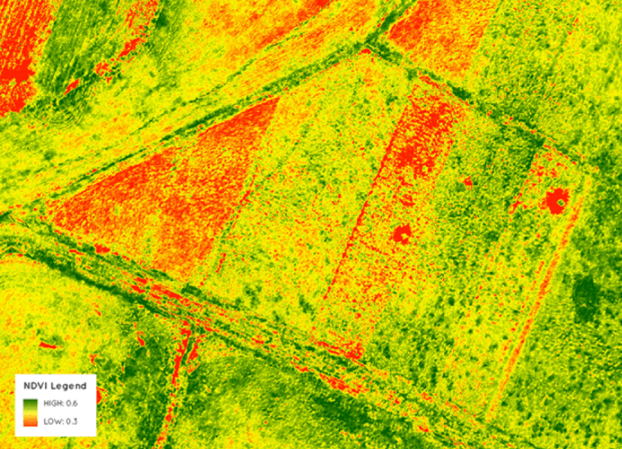

# Plugin para calculo de NDVI no QGIS
## NDVI
O Índice de Vegetação por Diferença Normalizada (NDVI) é importante no estudo de vegetação, pois evidencia, a partir do uso de imagens de satélite, o vigor e a caracterização da vegetação de uma área. Para realizar o cálculo de NDVI, é necessário ter as bandas 4 e 5 da imagem de satélite e utilizar um software que tenha disponível a função referente ao Raster Calculator.
## De forma manual é feita em:
No comando Adicionar imagem raster, inserir as imagens Landsat correspondentes às Bandas 4 e 5; para realizar o cálculo de NDVI acesse o menu Raster >> Calculadora Raster.
Na janela que se abre, digitar a fórmula (INF-RED)/(INF+RED).
O QGIS realizará o cálculo e em seguida mostrará a nova imagem gerada com as informações de NDVI.

## Automação
Dentro do QGIS apenas é necessário rodar o ndvi.py.
Lembre-se: As imagens devem estar no caminho D:/calculo_ndvi/imagens/

## Para melhor visualização é aconselhavel
Para melhor visualização como a imagem a baixo é aconselhado aplicar uma falsa cor.
Nas propriedades da imagem >>> Simbologia >>> Tipo de renderização
</img>
